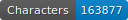
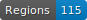
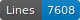
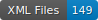

template-depot
===========================

    

## Données 

Les données se trouvent au chemin ‘./data/*/*.xml‘.
Elles sont au format alto (v.4) et suivent les normes de segmentation SegmOnto (https://segmonto.github.io). Toutes les données sont cataloguées sur HTR-United (https://htr-united.github.io). 

## Financeur

Ce projet est financé par le dataLab de la BnF (https://www.bnf.fr/fr/bnf-datalab).

## Projet

Gallicorpora propose de consolider et d'appliquer une chaîne de traitement pour les documents anciens de Gallica en diachronie longue, des premiers manuscrits français aux imprimés révolutionnaires. Au delà de la simple extraction de texte en masse, nous améliorerons les jeux de données d'entraînement pour l'apprentissage machine, les outils et les modèles déjà existants pour l'extraction, l'annotation et la diffusion de données richement annotées provenant des collections de la Bibliothèque nationale de France (BnF).

## Citer le projet 

*Gallic(orpor)a: extraction, annotation et diffusion de l'information textuelle et visuelle en diachronie longue*, Benoît Sagot, Laurent Romary, Rachel Bawden, Pedro Javier Ortiz Suárez, Simon Gabay, Ariane Pinche, and Jean-Baptiste Camps.

## Infrastructure

Il est produit sur l'infrastructure du projet CREMMA (https://www.dim-map.fr/projets-soutenus/cremma/).
Les données pour l'HTR sont produites à l'aide de l'interface eScriptorium (https://gitlab.com/scripta/escriptorium).
Les données de lemmatisation sont produites à l'aide de l'interface Pyrrha (https://dh.chartes.psl.eu/pyrrha/).